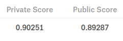

  
```{r setup, include=FALSE}
knitr::opts_chunk$set(echo = TRUE)
```

# Criação do modelo preditivo

Primeiramente, selecionamos os dados que serão utilizados para treino e teste do modelo.

```{r load_files, message=FALSE}
#O conteúdo do arquivo abaixo é o mesmo apresentado no kernel anterior
source('../src/02-toolkit.R')
library(caret)
library(MLmetrics)

#Carregando arquivos
files = list.files('../input', '.csv', full.names = T)

#Calculando o total de registros no dataset de treino
print(system('wc -l ../input/train.csv', intern = T))
```

Em busca de um conjunto de dados mais abrangente, optei por carregar 2.000.000 registros de cada 0.5% do arquivo de treino, totalizando uma amostra de 40.000.000 registros

```{r load_train_sample}
start_row_index <- 184903891 * seq(0, 0.95, 0.05)

#Serão lidos 2.000.000 registros de cada partição
batch_size <- 2000000
data_list <- lapply(start_row_index, function(x){
  fread(files[4], nrows = batch_size, skip = x,
        col.names = c('ip', 'app', 'device', 'os', 'channel',
                      'click_time', 'attributed_time', 'is_attributed'))
})

#E então, juntamos os dados extraídos em um único data frame
tbl_train <- rbindlist(data_list)
```

Para compreender as características dos registros que resultaram em download, selecionaremos uma sub-amostra balanceada 1/1 (1 download para cada 2 registros)

```{r train_sample}
set.seed(10)

#Selecionamos todas as ocorrências de download identificadas
train_sample <- tbl_train[is_attributed == 1]

#Calculamos o total de downloads
batch_size <- nrow(train_sample)

#Selecionamos aleatoriamente uma sub-amostra de tamanho equivalente 
#com registros que não resultaram em download
train_sample <- rbind(train_sample, tbl_train[is_attributed == 0][sample(.N, batch_size)])
```

As features serão calculadas a partir do dataset balanceado

```{r features}
features <- id_means(train_sample)
```

## Etapas de pré-processamento

Nosso pipeline de pré-processamento é composto pelas seguintes etapas:

* Calcular as informações de data e hora a partir do clique;

* Agrupar as features calculadas (médias por IDs);

* Retirar as colunas desnecessárias;

* Imputar valores missing;

* Converter a variável target.

```{r bind_features}
#Agrupando as features calculadas
bind_features <- function(tbl){
  data <- tbl
  data <- merge(data, features[[1]], all.x = T, by = 'app')
  data <- merge(data, features[[2]], all.x = T, by = 'app')
  data <- merge(data, features[[3]], all.x = T, by = 'device')
  data <- merge(data, features[[4]], all.x = T, by = 'device')
  data <- merge(data, features[[5]], all.x = T, by = 'os')
  data <- merge(data, features[[6]], all.x = T, by = 'os')
  data <- merge(data, features[[7]], all.x = T, by = 'channel')
  data <- merge(data, features[[8]], all.x = T, by = 'channel')
  return(data)
}
```

```{r drop_unused_cols}
#Retirando as variáveis não utilizadas IP e attributed_time
drop_unused_cols <- function(tbl){
  unused_cols <- c('ip', 'app', 'device', 'os', 'channel', 'click_time')
  if ('attributed_time' %in% names(tbl)) {
    unused_cols <- c(unused_cols, 'attributed_time')
  }
  return(tbl[, (unused_cols) := NULL])
}

```

```{r impute_constant_na}
#É provável que alguns IDs não tenham sido identificados durante o cálculo de features
#Ao tentar associar estes IDs em novos datasets, um valor NA será introduzido
#Estes serão substituídos por zero
impute_constant_NA <- function(tbl){
  data <- apply(tbl, 2, function(x){
    if (any(is.na(x))) {
      x[is.na(x)] <- 0
    }
    return(x)
  })
  return(as.data.table(data))
}
```

```{r convert_target_col}
#Realizado os cálculos, colocamos a variável target como fator
convert_target_col <- function(tbl){
  #Faremos a conversão apenas se o dataset informado possuir o registro de download
  if ('is_attributed' %in% names(tbl)) {
    tbl[, is_attributed := as.factor(is_attributed)]
  }
  return(tbl)
}
```

```{r pipeline}
#Pipeline de pré-processamento
prep_pipeline <- function(tbl){
  data <- strip_date(tbl)
  data <- bind_features(data)
  data <- drop_unused_cols(data)
  data <- impute_constant_NA(data)
  data <- convert_target_col(data)
  return(data)
}

#Realizamos o pré-procesasmento dos nossos dados de treino
train_sample <- prep_pipeline(train_sample)
```

### Train/test split

Da sub-amostra balanceada, 70% dos dados serão utilizados para treino e os demais 30% serão utilizados para validação

```{r train_test_split}
t_index = createDataPartition(train_sample$is_attributed, times = 1, p = 0.7, list = F)
train = train_sample[t_index,]
test = train_sample[-t_index,]
```

### Treinamento do modelo - Regressão logística (glm)

Para solucionar este problema, optei por utilizar um algoritmo de regressão logística devido a sua velocidade de treinamento e facilidade de compreensão.

Treinaremos um modelo simplificado utilizando todas as features calculadas. Em seguida, utilizamos a função *step*, que realiza a otimização da fórmula com base no [estimador AIC](https://en.wikipedia.org/wiki/Akaike_information_criterion).

```{r step_model}
#O primeiro modelo será criado utilizando todas as variáveis disponíveis
global_formula = formula(is_attributed ~ .)
glm_model = glm(global_formula, data = train, family = 'binomial')

#Em seguida, utilizamos a função 'step' para otimizar a fórmula e
#identificar a combinação de atributos que produz o melhor resultado
step_model <- step(glm_model, direction = 'both', trace = 0)
print(summary(step_model))
```

Com a fórmula otimizada, treinamos um novo modelo glm, dessa vez utilizando cross-validation para otimizar o treinamento.

```{r glm_model}
best_formula <- step_model$formula
tr_c = trainControl(method = 'repeatedcv', number = 10, repeats = 10)

glm_model = train(best_formula, data = train, method = 'glm',
                  family = 'binomial', trControl = tr_c)
```

### Importância das variáveis

```{r var_imp}
plot(varImp(glm_model, scale = T))
```

A média de downloads por app e channel foram as variáveis mais importantes deste modelo, sugerindo que o aplicativo anunciado e o canal de comunicação utilizado são as características que melhor representam a probabilidade de classificar corretamente a ocorrência de um download.

## Validação do modelo

Após o treinamento, realizamos as previsões nos dados de validação para observar a performance do modelo preditivo

```{r valid}
valid_preds = predict(glm_model, test)

#Análise das previsões - Confusion Matrix
print(ConfusionMatrix(valid_preds, test$is_attributed))
```

A matriz de confusão é uma das melhores formas de comparar os resultados previstos com os resultados reais. As linhas da matriz representam os valores reais, enquanto as colunas representam os valores previstos.

A partir de cada célula, podemos comparar diretamente o total de previsões corretas (True Positive - TP, False Negative - FN) e incorretas (True Negative - TN, False Positive - FP) e calcular os scores para avaliar a performance do modelo preditivo.

O valor 1 representa a classe positiva (download realizado) e 0 representa a classe negativa (download não foi realizado):


$TP = 26074$

$TN = 29675$

$FP = 875$

$FN = 4476$


### Accuracy
$$ Accuracy = \frac{TP + TN}{TP + TN + FP + FN} $$

```{r valid_accuracy}
print(Accuracy(valid_preds, test$is_attributed))
```

Para um conjunto de dados balanceado nosso modelo obteve 91.24%, entretanto nós sabemos que normalmente é esperado uma proporção muito inferior de downloads.

*Accuracy* não será a melhor métrica para avaliar nosso modelo preditivo, pois é esperado uma proporção muito menor de downloads. Num cenário hipotético, se apenas 1% dos registros resultarem em download e o modelo preditivo prever 0 downloads, este modelo terá um score de 99%.

### Precision

$$ Precision = \frac{TP}{TP + FN}  $$

```{r valid_precision}
print(Precision(test$is_attributed, valid_preds, positive = '1'))
```

Com um dataset balanceado, obtivemos um score de 96.75%. Esse percentual indica a proporção de previsões corretas em relação ao total de **previsões positivas**.

### Recall

$$ Recall = \frac{TP}{TP + FP}   $$

```{r valid_recall}
print(Recall(test$is_attributed, valid_preds, positive = '1'))
```

Com um dataset balanceado, obtivemos um score de 85.34%. Esse percentual indica a proporção de previsões corretas em relação ao total de **downloads**.

### F1-Score

$$ F1 = 2 * \frac{Precision * Recall}{Precision + Recall} $$

```{r valid_f1}
print(F1_Score(test$is_attributed, valid_preds, positive = '1'))
```

A finalidade do score F1 é apresentar um resultado balanceado dos scores *Precision* e *Recall*. Dessa forma, podemos avaliar a performance do modelo agrupando estes dois aspectos.

## Teste do modelo

Nosso modelo apresentou uma boa performance durante as etapas de validação. Entretanto, sabemos que não é esperado receber registros perfeitamente balanceados 1/1.

Precisamos testar este modelo com um novo dataset, que seja semelhante aos resultados esperados num contexto real.

```{r test}
#Serão selecionados 1.000.000 registros aleatoriamente
batch_size <- 1000000

#Seleção e pré-processamento dos dados
test_sample = prep_pipeline(tbl_train[sample(.N, batch_size)])

#Realizando novas previsões
test_preds = predict(glm_model, test_sample)

#Análise dos resultados - Confusion Matrix
print(ConfusionMatrix(test_preds, test_sample$is_attributed))
```

A matriz de confusão demonstra que o modelo identificou a grande maioria dos cliques que não resultaram em download. Entretanto, percebemos uma grande quantidade de previsões positivas incorretas: neste dataset ocorreram apenas 2476 ($356 + 2120$) downloads, mas foram previstas 31199 ($29079 + 2120$) ocorrências!

### Scores

```{r}
print(paste0('Accuracy: ', Accuracy(test_preds, test_sample$is_attributed)))
print(paste0('Recall: ', Recall(test_sample$is_attributed, test_preds, positive = '1')))
print(paste0('Precision: ', Precision(test_sample$is_attributed, test_preds, positive = '1')))
print(paste0('F1 Score: ', F1_Score(test_sample$is_attributed, test_preds, positive = '1')))
```

Obtivemos uma pequena melhoria em *Accuracy*, em grande parte devido a previsões negativas (download não foi realizado).

*Recall* permaneceu semelhante ao observado durante a validação, enquanto *Precision* teve uma redução significativa, o que é refletido no score F1.

A partir deste ponto, podemos escolher uma dessas métricas para tentar melhorar a performance do modelo. Sabemos que menos de 1% dos cliques resultarão no download do aplicativo. Se tentarmos melhorar a *Precision* do modelo, mais ocorrências de download serão previstas, o que resultará na redução de *Recall* visto que a maioria das previsões serão falsos positivos.

# Submetendo resultados ao Kaggle

Vamos verificar a performance deste modelo diretamente na competição.

```{r kaggle, eval=FALSE}
#Pré-processamento
kaggle_data <- prep_pipeline(fread(files[2]))

#Efetuando previsões
submission_preds <- predict(glm_model, kaggle_data)

#Agrupando as previsões por click_id
submission <- data.table(click_id = as.integer(kaggle_data$click_id),
                         is_attributed = submission_preds)

#Reordenando os IDs
submission <- submission[order(click_id)]

#Gravando arquivo
fwrite(submission, 'output/glm_submission.csv')
```




A métrica utilizada para calcular este score é a AUC, que busca estimar a proporção de True Positive (TP) e False Positive (FP) abaixo da curva ROC. Obtivemos uma performance satisfatória em ambos leaderboards.